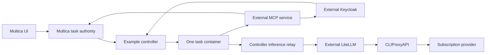

# End-to-end integration lab

Real Multica → one OpenCode container → controller relay → LiteLLM → CLIProxyAPI → a subscription.
Keycloak issues identity outside the sandbox. Remote MCP reads the assigned real
Multica issue and a generated reference word. The agent must write that word to
`result.txt`; the trusted runner verifies it before completing the Multica task.

This persistent local lab is separate from the production controller. It supports
one seeded workspace/agent/task, not arbitrary tasks. SQL seeds fixture records;
claims, start, heartbeat, status, task reads and completion use real Multica HTTP.

## Responsibility boundary



Only a short-lived MCP access token and an opaque per-attempt inference credential
enter the agent. Client secrets, Multica credentials, the LiteLLM master and
workspace keys, the proxy bridge key and subscription refresh credentials stay in
trusted services. The controller configures neither model routing nor tool
permissions; Compose assembles example infrastructure for testing.

MCP checks issuer, signature, expiry, audience, agent subject, client, role and
running task state. Inference follows ADR 0012: `setup` creates a LiteLLM virtual
key for the lab workspace (model `demo`, rate limits). The lab controller serves
`internal/relay` as `inference-relay` on the sandbox network and swaps the agent's
credential for that key. LiteLLM is not on the sandbox network; it rejects other
models and provider credential/endpoint overrides.
Inference remains ordinary HTTP; models may request tool calls which the agent
executes through MCP. MCP is not required as an inference transport.

## Run

Requires Docker Compose; allow several GB for images and at least 1 GB per agent.
Ports 3001 and 8081 bind only to loopback. No subscription or API credential files
from your workstation are copied into the lab. Dependencies are pinned by digest.
The backend builds unmodified Multica main `b4ca5b4` (verified 2026-10-04); the UI
uses the latest published image, v0.6.1. Upgrade pins together with contract tests.

```sh
./scripts/e2e.sh prepare
./scripts/e2e.sh login
./scripts/e2e.sh check
./scripts/e2e.sh run
```

`login` prints a Codex device URL/code. Complete that login yourself; credentials
are stored in the `sandbox-e2e_subscription` volume, shared only by proxy/login.
`run` makes real model requests using that subscription. It executes one task;
use `reset` then `prepare` to create a fresh fixture for another run.
Set `UPSTREAM_MODEL` before `prepare` to select the proxy's upstream model;
Multica and the agent use the stable `demo` alias. Default: `gpt-5.6-luna`; use `./scripts/e2e.sh models` to see available IDs.
Change LiteLLM routing and CLIProxyAPI configuration to use another provider;
subscription login is an example source, not a required production credential type.

Open [Multica](http://localhost:3001). The fixture email is
`fixture@example.invalid`, development verification code `222222`. Inspect the
E2E workspace, agent, issue and task result. Only the seeded issue is supported
by this example runtime; adding arbitrary tasks does not enable adapter support.

```sh
./scripts/e2e.sh stop
./scripts/e2e.sh reset
```

`stop` removes lab containers and any labeled attempt, retaining volumes.
`reset` additionally removes fixture config/realm/database, retaining subscription
login. To forget the subscription after stopping, explicitly remove
`sandbox-e2e_subscription` with `docker volume rm`. Never use real task data here.
Keycloak development mode, private HTTP and the fixture database password are for
this loopback lab only. Trusted services share a generated configuration volume;
a production deployment must give each service only its own credentials.

## Follow one task in code

1. `initialize.go:initialize`: fixture secrets, realm, roles and the MCP audience.
   `setup.go:setup`: seed records, register OpenCode, create the workspace key.
2. `execute.go:execute`: claim real task, issue an MCP token and a relay grant
   (`relay.go`). Pass only the explicit safe task projection.
   Claim payload credentials and arbitrary environment/MCP settings are ignored.
3. `execute.go:sandbox`: fresh non-root container, read-only root, bounded tmpfs,
   resources and internal network. Deliver JSON through stdin, monitor task state,
   remove the container and report the verified result to Multica.
4. `agent.go:agent`: example OpenCode adapter; configure the external endpoints
   and short-lived bearer identities, run the CLI, parse output and verify the
   result artifact. Provider credentials are absent from its image/input.
5. `mcp.go:verify`: external role/task-state checks; `readTask` reads real Multica
   context. `relay.go`: workspace-key inference relay, separate from the sandbox.

## Agent choice and custom images

| Option | Fit | Adapter work |
| --- | --- | --- |
| OpenCode | First example: configurable providers and remote MCP | JSON events, MCP headers, custom provider |
| Codex CLI | Native Codex behavior; gateway must support Responses | CLI events, configuration and identity helper |
| Claude Code | Native Claude behavior; gateway must support Messages | CLI events, configuration and identity helper |
| Custom image/agent | Operator chooses the toolchain | Implement and verify the single-task runner contract |

OpenCode is an example, not a mandatory base image. A custom Dockerfile may
supply its own agent and tools. Backend policy still controls mounts, networking,
resources and credentials. An adapter must translate task context and identity,
return supported events/results and stop on cancellation; simply accepting JSON
or having an executable is insufficient to advertise production compatibility.
The example stdin/result envelope is experimental, not a stable public ABI.

## Limits

No repository checkout, retained sessions, cache, multi-workspace inference,
Kubernetes or full CLI event/usage mapping is implemented. MCP tokens last 180 seconds;
the run deadline is 150 seconds. This lab maps one principal to one fixed task;
concurrent attempts need external attempt binding/leases under ADR 0009.
Task-state authorization denies new MCP calls after termination; ending the relay
grant denies and cancels inference requests. Docker network topology blocks direct upstream
access, but host/metadata isolation and adversarial conformance still require
verification before production use. The controller has host Docker authority.
Images/libraries are real; successful provider execution requires a working login.
The lab checks missing/wrong-audience identity, inactive/ended tasks, ungranted
models/resources, unsupported routes and provider overrides. CI stays paused. See [ADR 0010](../../adrs/0010-external-access-and-agent-adapters.md).
