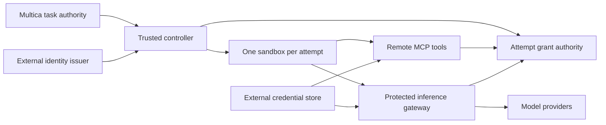

# Identity and MCP contract fixture

A disposable Keycloak + official MCP Go SDK example. Two attempts share one
service client but receive distinct short-lived access tokens and resource grants.
The base scenario is a protocol fixture. `./scripts/test-opencode.sh` adds native
OpenCode 1.18.34 task containers and real JWT renewal through the controller adapter.
Neither fixture is a production gateway.
It also exercises static/external identity resolution against real Keycloak through
[the controller identity module](../../internal/identity/README.md).

## Intended boundary



The sandbox receives short-lived identity only. Tool and provider credentials
stay in trusted services. Inference uses an OpenAI-compatible HTTP contract;
tool operations use MCP. Network policy must enforce these destinations outside
the sandbox. Multica public runtime visibility is not downstream authorization.

## Run

Requires Docker Compose and network access to pull/build images. No host ports,
host directory mounts or Docker socket are exposed to this fixture.

```sh
./scripts/test-identity.sh
```

The script builds, runs assertions and removes its own containers and volumes.
For an inspectable stand, from the repository root:

```sh
docker compose -p identity-demo -f examples/identity-mcp/compose.yaml up --build -d --wait gateway
docker compose -p identity-demo -f examples/identity-mcp/compose.yaml run --rm scenario
docker compose -p identity-demo -f examples/identity-mcp/compose.yaml down -v
```

Startup may take a minute. The gateway waits for issuer discovery while Keycloak imports its realm. Generated fixture credentials live only in named volumes;
remove volumes to reset them. Keycloak uses development mode and private HTTP.
Never use real credentials or expose these services externally.

## Walk through the code

1. `main.go:initialize` generates a service-client secret, grant-admin credential
   and a realm with a 120-second token lifetime and `sandbox-mcp` audience.
2. `scenario.go:token` acts as the **trusted controller fixture**, obtains two
   access tokens for one client, then `enroll` binds each token fingerprint to
   workspace, agent, task, attempt and resource in trusted state.
3. `gateway.go:verifier` checks signature, issuer, audience, expiry, Keycloak's
   access-token type, expected client and an active grant. SDK middleware guards
   the MCP endpoint; `read` checks the current grant and concrete tool arguments.
4. `scenario.go:scenario` proves allowed calls, cross-attempt/resource and
   cross-workspace denial, unregistered and malformed-token rejection and refusal of grant-admin
   access with a run token. Revoking A denies new A calls while B still works.

The scenario process deliberately has fixture credentials: it models the trusted
control plane and client calls together. It is **not** the untrusted agent image.
The issuer does not attest the task binding; the trusted fixture registers it.
`/grants` and its in-memory registry are test plumbing, not a new IAM product.
Restarting the gateway loses grants and denies access until re-registration.
Revocation applies to new calls, not cancellation of already running operations.

## What we still need to integrate

- Map `(issuer, subject)` to a Multica agent; keep client authentication outside
  sandboxes. This fixture restricts a single Keycloak client with `azp`.
- Bind grants to controller-authorized attempts; revoke on completion, cancellation
  and recovery. Define leases/fail-closed behavior during controller outages.
- Deliver narrow identity to the correct workload using deployment attestation;
  forbid one sandbox from obtaining another attempt's token.
- Connect an existing MCP authorization service and inference gateway to the same
  grant decisions. Use separate audiences; validate model/resource ACLs and budgets.
- Configure TLS, external network enforcement, durable audit and distributed grant
  state before claiming production support. Provider credentials stay external.

This fixture does not run Multica, a coding agent, LiteLLM or inference, and does
not prove egress isolation, token-delivery security or production HA. The OpenCode variant uses two isolated task containers, 20-second real JWTs and
24 MCP tool turns per task; inference responses are deterministic and use no account.
It verifies at least three successfully used JWTs, multiple expiries,
issuer/resolver outages and cancellation, then denies ended tokens before their expiry.
It exposes no host ports. Only its trusted scenario mounts the Docker socket.
`VERIFY_SERVICE=1 VERIFY_OPENCODE=1 ./verify.sh` also tests a real Multica claim
through the persistent Compose controller. Inference identity remains #22. See [ADR 0009](../../adrs/0009-attempt-authorization.md).
