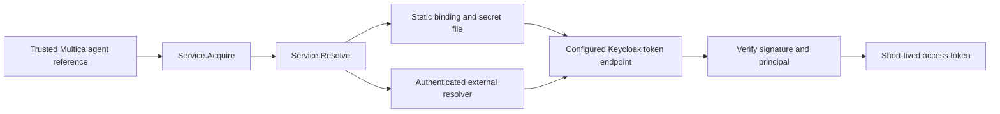

# Identity resolution

Controller-side module for issue #21. It resolves trusted Multica agent references,
reads credentials and verifies a Keycloak service-account access token. It has no
background renewal loop and is not yet connected to controller task claims or
workload delivery (#19).



## Static configuration

`ReadConfig` parses strict JSON; `New` validates policy and creates the service.
Paths are absolute. `server` is the canonical Multica origin without a trailing
slash. Only the operator/controller supplies the reference to `Acquire`; workload
input is not authoritative. Missing bindings fail closed.
Static bindings enforce one principal/client per agent, including when an agent
is available in multiple workspaces. Different agents cannot share that identity.

```json
{
  "version": 1,
  "server": "https://multica.example.com",
  "issuers": [{
    "name": "corporate",
    "url": "https://sso.example.com/realms/agents",
    "token_url": "https://sso.example.com/realms/agents/protocol/openid-connect/token",
    "jwks_url": "https://sso.example.com/realms/agents/protocol/openid-connect/certs",
    "resources": {
      "mcp": {"audience": "corporate-tools", "max_ttl_seconds": 300}
    }
  }],
  "bindings": [{
    "workspace_id": "10000000-0000-4000-8000-000000000001",
    "agent_id": "20000000-0000-4000-8000-000000000001",
    "issuer": "corporate",
    "client_id": "agent-builder",
    "subject": "expected-service-account-subject",
    "secret_file": "/run/secrets/agent-builder"
  }]
}
```

Mount secrets only into trusted controller infrastructure, with restrictive file
permissions. No secret belongs in this JSON, Git, a task payload or a workload
mount. Files are bounded, read on each issuance and may be atomically replaced;
projected-secret symlinks are supported. A trailing newline is stripped. Only
regular, absolute-path files are accepted.

The first issuer adapter supports Keycloak-style RS256 JWT access tokens with
`typ=Bearer` and the expected `azp`. It verifies signature, issuer, audience,
subject, client, issuance time and expiry. Maximum lifetime is configured per
resource and cannot exceed one hour. `scopes` and `resource` are optional token
request parameters; tool permissions remain the MCP service's responsibility.
Opaque tokens and other issuer claim conventions require another adapter.

## External configuration and wire contract

Replace `bindings` with the following block; there is no fallback between sources:

```json
{
  "external": {
    "url": "https://identity.example.com/v1/resolve",
    "bearer_file": "/run/secrets/identity-resolver"
  }
}
```

Keep the `issuers` policy locally. The service must authenticate the controller
and authorize its binding access. Its reply references an approved issuer name;
it cannot supply token/JWKS URLs. The resolver owns consistency of external
agent-to-principal bindings, including the one-agent-per-client rule.

The controller sends POST with its own Bearer credential and this JSON:

```json
{"version":1,"agent":{"server":"https://multica.example.com","workspace_id":"10000000-0000-4000-8000-000000000001","agent_id":"20000000-0000-4000-8000-000000000001"}}
```

A successful HTTP 200 response echoes that exact reference:

```json
{"version":1,"agent":{"server":"https://multica.example.com","workspace_id":"10000000-0000-4000-8000-000000000001","agent_id":"20000000-0000-4000-8000-000000000001"},"issuer":"corporate","client_id":"agent-builder","subject":"expected-service-account-subject","client_secret":"<secret>"}
```

Unknown fields, wrong versions/references, empty credentials, unavailable services
and non-200 replies fail closed. Resolver credentials are re-read each time.
HTTP requests have a ten-second limit and 64 KiB response bound. Redirects and
proxy environment variables are disabled; HTTPS is required unless the operator
explicitly enables `allow_http` for an isolated fixture. Raw remote errors and
credentials are never included in module errors. Credentials/tokens reject JSON
serialization and redact formatting; delivery uses the explicit `Bearer()` method.

## Walk through the code

1. Static rotation: `Service.Acquire` → `Service.Resolve` →
   `staticResolver.Resolve` → `readSecret` → `issuer.issue`. Replace a secret file;
   the next issuance reads the replacement.
2. External binding: `remoteResolver.Resolve` authenticates and checks the echoed
   reference; `Service.Resolve` rejects an unapproved issuer before token issuance.
3. Wrong principal: `issuer.issue` rejects a correctly signed token for another
   subject/client/audience. No token is returned to a delivery adapter.

Run `go test -race ./internal/identity` for contract/adversarial tests and
`./scripts/test-identity.sh` for both resolver paths against real Keycloak.
These tests do not establish task attestation, resource grants or ongoing renewal.
