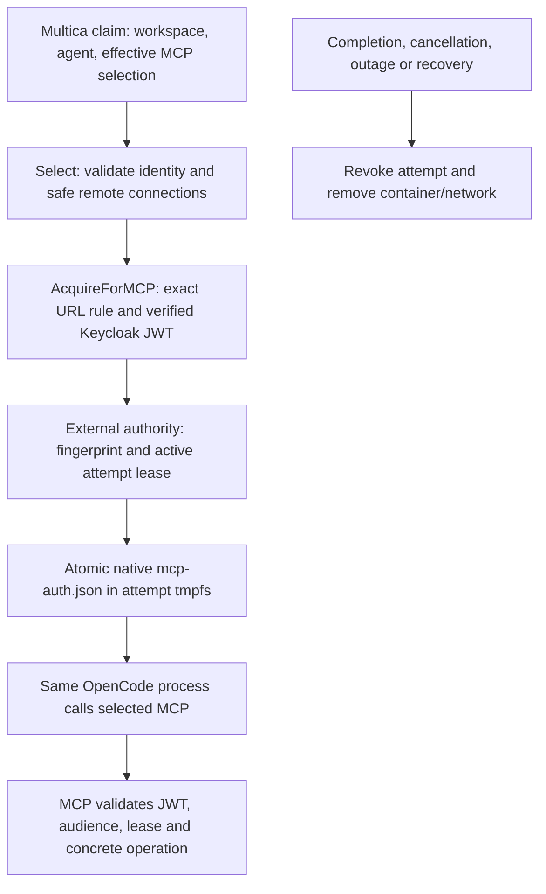

# Experimental OpenCode MCP adapter

The persistent controller's opt-in OpenCode path projects trusted Multica task
context, acquires verified identity and rotates the native MCP OAuth store during
one disposable attempt. Images are user-owned; the controller
inspects the digest-pinned image once at startup against the [image contract](#image-contract). Optional inference uses the workspace-key relay from ADR 0012. The [conformance](#conformance) section lists pinned versions, verified behavior with its tests and explicit limitations.

## Configuration

Start from `deploy/controller.example.json`; set a digest-pinned OpenCode-compatible
image and add `opencode` using `deploy/opencode.example.json`. Mount its identity
configuration, static/external secret files and authority credential **only into the
controller**, for example through a local Compose override. The base Compose manifest
has no corporate identity mounts. Keep all actual configuration outside Git.

`network` names an operator-owned internal bridge template containing exactly the named `peers`. Each attempt gets a new internal network with only those peers and its own container. Template peer aliases preserve the selected MCP hostname. Place Multica, IAM, resolver and credential stores on a separate control network. Only approved MCP/gateway services may be peers. Enforce host/metadata and destination policy outside Docker; internal bridges do not establish a production adversarial egress boundary. Do not attach untrusted workloads/services to the template. Concurrent attempt containers never share a network.

The default command is `opencode run --format json` with the projected prompt. An operator-supplied command may use the same `/workspace/prompt.txt` and `/workspace/opencode.json`; only controller configuration chooses that command. Images may include their own tools and credential-free provider configuration; [tool bundles](#image-contract) add tools without rebuilding the image. No inference/provider credential is permitted in an image or command; managed inference uses `inference_file` and `inference_relay`; see [`internal/inference`](../inference/README.md). The fixture supplies a mock provider from trusted test configuration solely to exercise tool turns without a subscription.

## Image contract

Users build images in their own CI; the controller never builds Dockerfiles or pulls.
At startup it runs `ImageProbe` offline within attempt limits and fails closed
with every incompatibility. The optional base is an official image from
[`images.txt`](images.txt) (Alpine), unchanged or extended with `FROM`; no project
base is published. `examples/agent-image/debian.Dockerfile` shows an unrelated base
with the released glibc OpenCode build. A compatible image:

- matches the Docker engine platform (`linux/amd64` or `linux/arm64`) and declares no volumes;
- has `/bin/sh` with `sleep`, `mkdir`, `cat`, `chmod`, `mv`, and `opencode` on `PATH`
  reporting a verified version (`Supported` in `image.go`); `/opt/multica-sandbox` is reserved;
- ships no `/etc/opencode`, `/opencode.json[c]` or `/.opencode`, which OpenCode merges
  over the projected configuration, and no `OPENCODE_*` or `MULTICA_*` image `ENV`;
- runs as uid 65532 on a read-only rootfs without network: `HOME` and `XDG_*` are
  in the executable `/workspace` tmpfs, `/tmp` is `noexec`; install tools at build time;
- carries no secrets: everything in the image is visible to the agent.

Entrypoint, command, `USER` and `HEALTHCHECK` are ignored. The version check is a
compatibility contract, not a security boundary: host policy holds for any image.

Tool bundles: top-level `tools` lists `{name, image, path?, check?}` (ADR 0002; `examples/tool-bundle`). Each digest-pinned, preloaded bundle is mounted read-only at `/opt/multica-sandbox/tools/<name>`; its `path` directories (default `bin`) follow the `multica` CLI and precede the image `PATH`, in declared order. Startup rejects missing `path` entries, commands provided twice and reserved commands (`opencode`, `multica`, `sh`, `sleep`, `mkdir`, `cat`, `chmod`, `mv`), then runs each `check` argv (first element relative to the bundle) offline in the agent image. Build bundles self-contained (static or with their own loader) and relocatable: a glibc binary on a musl image fails with `ENOENT`, and a shell then silently runs the image command of the same name. Bundles are compatibility inputs; host policy holds for their contents, including setuid files.

## Multica API relay

`multica_relay` (`listen`, `url`) enables ADR 0014: the controller relays the upstream `multica` CLI to its configured Multica origin, replacing a per-attempt `mat_relay_` credential with the claim's `mat_` token held only in memory. Add the controller container to the template `peers` with the alias named by `url`; Multica stays on the control network. `multica_cli` names the CLI artifact built by `deploy/multica-cli.Dockerfile` from the pinned revision; preload it by digest like the agent image. The controller mounts it read-only at `/opt/multica-sandbox/multica` (Docker image mount, ADR 0002) first on `PATH`, so image copies or `PATH` cannot shadow it, and requires `multica` to resolve to it at startup; images need no `multica`. Issue tasks then receive the upstream prompt, an `AGENTS.md` brief, the `MULTICA_*` environment and in-container `bash`/file tools. Grants end at cleanup or controller restart; credential-minting, daemon and account routes are denied. With `helper`, `git_relay` and `git_file`, the unchanged `multica repo checkout` works inside attempts on a workdir volume, plain `git push` publishes branches through the Git relay, and with `forge_relay` the unchanged `gh` opens pull requests ([`internal/repo`](../repo/README.md)). `sessions` (`ttl`, `max`) with the helper retains issue workdirs for resume (below).

## External authority adapter

`internal/attempt` POSTs authenticated version-1 JSON to one configured endpoint.
It disables redirects/proxy environment, re-reads the controller-only bearer file
and requires HTTP 204. HTTPS is required outside explicit isolated fixtures.
The authority is external; this repository contains only a fixture implementation.

`renew` includes `controller`, the dispatch-fenced `attempt`, `server`,
`workspace_id`, `agent_id`, `task_id`, `mcp_url`, SHA-256 `token_hash`, and epoch-second
`expires_at`. It contains no bearer JWT. Inference grants live in the controller relay, not here. The authority authenticates the controller,
validates references/recipients, and registers or renews a bounded active grant.
`revoke` ends every fingerprint for an attempt; `recover` ends the controller's
previous grants. Both must be idempotent. Ended attempts cannot be re-enrolled and
a fingerprint cannot move between attempts. Every receiving MCP operation checks
JWT identity/audience and an active unexpired grant, including concrete resources;
`tools/list` must expose only authorized tools. The authority must enforce these
rules independently and fail closed on loss of state. In-flight operation cancellation
is outside this contract. A stopped renewal loop alone does not revoke a JWT.

## Native reporting

The adapter reads `opencode run --format json` with the upstream OpenCode backend
rules (`server/pkg/agent/opencode.go`). Text, reasoning, status and paired tool
use/results go to Multica in 500 ms best-effort batches with ordered `seq` and
unchanged call IDs. Tool results use the upstream 8 KiB UTF-8 preview; unknown or
non-JSON lines are skipped; a 10-minute silent stream stops (`idle_watchdog`).
Terminal signals and error wording match upstream, so Multica classifies failures
and retries; native error bodies are withheld. Usage is the sum of `step_finish`
counters, reported once as provider `opencode` with the applied model or `unknown`.
The native session ID is reported mid-flight and on completion; without a retained workdir it carries `session_rollout_missing`, so Multica never resumes it. With `sessions` (and the helper), upstream issue tasks keep one workdir volume per (controller, workspace, agent, issue), reported as `work_dir`, holding the session database (`OPENCODE_DB`). A follow-up resumes `prior_session_id` with `opencode run --session` only when `prior_work_dir` names that pre-existing volume; otherwise it starts fresh with the upstream continuity notice, which `prior_session_resume_unavailable` also adds. A resume that yields no session and no tool use is retried fresh once and reports `retired_session_id`. Resumed comment tasks get upstream's warm hints from the claim's issue-state and comment deltas; claims advertise `coalesced-comments-v1`, and coalesced comments are embedded with per-thread reply targets. Delta shapes the server would not send keep the cold reads; malformed coalesced comments reject the claim. A second writer waits 15 s, then gets a per-attempt volume. `ttl` after last use and a `max` count bound retention; they are collected at startup and after session runs, and restart reconciliation keeps session volumes.
Complete/fail follow cleanup and use a durable at-least-once queue.

## Conformance

Supported means this path only: persistent controller, Docker projected backend,
native OpenCode. Evidence is fixture-based for the pinned stack, not production
certification. Pins: Multica `b4ca5b4a23e68b26292a680dca7689a952bb1cd5`
(unmodified); OpenCode 1.18.34 (`aec0b9a6`) and 1.18.35 (`53d1eabb`), official images in `images.txt`; LiteLLM v1.104.0 with
Postgres virtual keys; Keycloak 26.8.0; MCP Go SDK 1.8.0; go-oidc 3.21.0; Docker
Engine 29.2.1 (runc, cgroup v2, `linux/arm64`; `amd64` is unverified). Reproduce with `MULTICA_SOURCE=<checkout>` and
`VERIFY_CONTAINERS=1 VERIFY_SERVICE=1 VERIFY_OPENCODE=1 VERIFY_INFERENCE=1 VERIFY_IDENTITY=1 ./verify.sh`.

| Verified behavior | Evidence (flags) |
| --- | --- |
| Trusted context only; safe repository references | `projection_test.go`; `claim-secret-sentinel` in `integration/managed_mcp_test.go` (SERVICE, OPENCODE) |
| Messages, tool pairs, order, usage, session, terminal signals | `events_test.go`; `integration/adapter_reporting_test.go` |
| Upstream failure reasons, durable reports, replay before recovery | `internal/multica/outbox_test.go`; `integration/retry_test.go` (UPSTREAM) |
| Cancellation revokes and cleans up before the terminal callback | `adapter_test.go`; `integration/upstream_test.go`; fixture `cancelled` (OPENCODE) |
| Restart: old attempts removed, authority `recover`, relay grants lost | `integration/service_recovery_test.go`; `rotation_lease.go`; `restartFailsClosed` |
| Concurrent workspaces; 100-workspace fairness | `examples/identity-mcp/rotation.go`, `inference.go`; `integration/fleet_test.go` |
| MCP JWT rotation across expiries, exact recipient, per-attempt store | `rotation.go` (OPENCODE); `internal/identity` tests |
| Issuer/resolver outage; ended JWTs denied before expiry | `examples/identity-mcp/rotation_failures.go` (OPENCODE) |
| 15 s outage lease; no fingerprint move or re-enrollment | `examples/identity-mcp/rotation_lease.go` (OPENCODE) |
| MCP checks resource/attempt/workspace per call | `examples/identity-mcp/scenario.go` (IDENTITY) |
| Multica relay: opaque credential, token-minting denied; controller CLI is a read-only image mount first on `PATH`, image `multica`/`PATH` cannot shadow it; writes, extra or altered mounts, unpinned, absent and wrong-revision artifacts rejected | `internal/relay` tests; `policy_test.go`; `image_test.go`, `projected_test.go` (CONTAINERS); `integration/multica_relay_test.go` |
| Workspace keys: spoofing, cross-workspace, forged/ended, key change, stream revocation, 403/422 without substitution | `internal/inference`, `internal/relay` tests; `inference.go` (INFERENCE); `integration/inference_test.go` |
| No `mat_`/gateway/provider key in attempt env/files, logs, transcript, comments, results | `integration/multica_relay_test.go`, `inferenceCredential` |
| Tool bundles: read-only, declared `PATH` order; reserved, duplicate and missing entries, failing checks and escaping paths rejected; setuid cannot elevate; the agent runs a bundled `jq` | `tools_containers_test.go`, `image_test.go` (CONTAINERS); `integration/multica_relay_test.go` |
| User images: unsupported version, OpenCode config overrides, reserved `ENV`, volumes and platform rejected; `USER`, setuid and entrypoint cannot change identity | `image_test.go`, `create_failure_test.go` (CONTAINERS) |
| Bases: Debian with the newest released OpenCode completes the relay, inference and restart path; every `images.txt` image completes the relay unchanged, and references elsewhere must be listed; none contains `multica`; attempt probes run from a sidecar, not image tools | `examples/agent-image/debian.Dockerfile`; `integration/multica_relay_test.go` (SERVICE, OPENCODE); `image_test.go` |
| Repository checkout and push: unchanged CLI clones a claim repository through the Git relay on the task branch; upstream kept/fresh/ref/path semantics; plain `git push` publishes it with the configured identity and the upstream co-author trailer; unchanged `gh` opens a pull request through the forge relay; host password absent from attempt, volume and logs; unlisted repositories, Multica credential on Git, foreign workdir and ended fetch/push grants denied; volume owned by the attempt user, removed at cleanup and restart | `internal/repo` tests; `workdir_test.go` (CONTAINERS); `integration/multica_relay_test.go` (SERVICE, OPENCODE) |
| Session resume: a comment follow-up resumes the retained native session in the same workdir with upstream warm hints (comment count, changed issue fields, multi-thread replies); every hint branch, continuity gate and malformed delta; a missing session is retired and replaced fresh; other agents, issues and workspaces get other volumes; concurrent writers, forged `prior_work_dir` and unlabelled volumes are refused; session cap and TTL; restart keeps only labelled session volumes; no credential in the volume | `session_test.go`; `projection_test.go`; `sessions_test.go` (CONTAINERS); `integration/multica_relay_test.go` (SERVICE, OPENCODE) |
| Hostile workload: no capabilities/sockets/secrets/metadata, limits, no route, external DNS, IPv6 or other attempt | `internal/docker/backend_test.go`, `projected_test.go` (CONTAINERS) |

Deployment-owned, verified only as integration contracts: production egress policy,
attempt-network TLS, host and kernel hardening (gVisor/Kata/Sysbox); workload
attestation and the attempt authority (this repository ships fixture plumbing); MCP
tool/role/resource authorization; gateway grants, budgets and routing. Revocation denies
new MCP operations but does not cancel MCP work in flight; relay streams are cancelled.
While the controller is down no backend deadline exists; Kubernetes deadlines and
distributed ownership are #6.

Limitations: verified OpenCode releases only (`images.txt`); 2.x is unsupported because upstream cannot deliver MCP to it safely; other agents need their own conformance. Resume needs `sessions`; chat tasks and attempts without the helper start fresh; squad-leader reply variants are not rendered. Retained workdirs keep agent-written project config such as `opencode.json`, as native workdirs do; volume bytes are unbounded (deployment quotas). Only issue tasks use the upstream prompt and `multica` CLI; chat and other kinds use the bounded legacy prompt. Pushes and `gh` are bounded by the deployment credential and forge branch protection, as under the native runtime; unsupported: project resources, skills, broker MCP connections,
connected apps, artifact publication, chat/autopilot/quick-create CLI workflows.
Discovery entries lack context/output; pickers and inference grants are per workspace.
Native retries, including HTTP 429, stay native; fixture token counts are not billing
evidence; LiteLLM does not record auth-stage refusals per end user. The Multica relay
credential keeps upstream agent authority for the attempt minus denied routes. Tests
seed tasks in the database, not the UI. Local digest-pinned images need the containerd
image store. Image mounts are experimental in Docker and lack `nosuid`/`nodev` (host
policy covers both); they and external DNS denial on internal networks are engine
behavior: re-run `VERIFY_CONTAINERS=1` after Docker upgrades. Do not fill gaps with a
sandbox Git service, session store, IAM, tools or policy engine.

Inspection sources: Multica `server/internal/daemon/{types,client,prompt}.go`,
`server/internal/handler/daemon.go`, `server/pkg/agent/opencode.go`; OpenCode
`packages/opencode/src/cli/cmd/run.ts`. Multica daemon internals and host
`execenv/repocache` are not a disposable delivery API; reuse the HTTP schemas.
