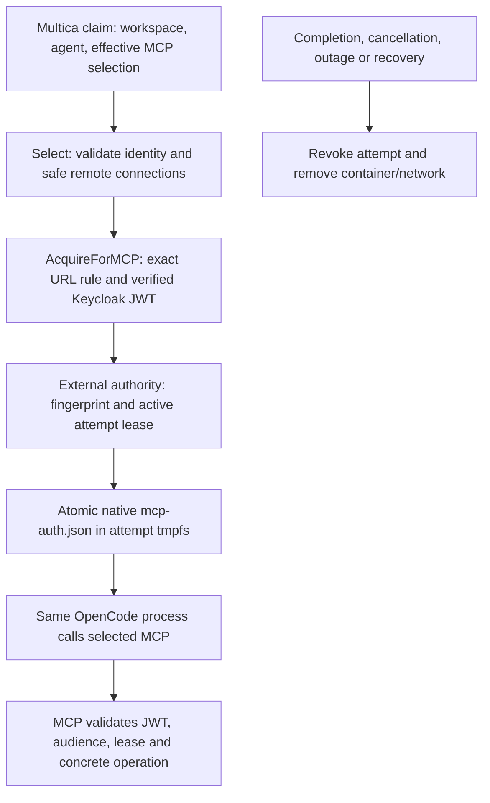

# Experimental OpenCode MCP adapter

The persistent controller's opt-in OpenCode path projects trusted Multica task
context, acquires verified identity and rotates the native MCP OAuth store during
one disposable attempt. OpenCode is pinned to 1.18.34 (source `aec0b9a6`); a version
check precedes execution, including for user-supplied images. Optional inference uses the workspace-key relay from ADR 0012. The [conformance](#conformance) section lists pinned versions, verified behavior with its tests and explicit limitations.

## Configuration

Start from `deploy/controller.example.json`; set a digest-pinned OpenCode-compatible
image and add `opencode` using `deploy/opencode.example.json`. Mount its identity
configuration, static/external secret files and authority credential **only into the
controller**, for example through a local Compose override. The base Compose manifest
has no corporate identity mounts. Keep all actual configuration outside Git.

`network` names an operator-owned internal bridge template containing exactly the named `peers`. Each attempt gets a new internal network with only those peers and its own container. Template peer aliases preserve the selected MCP hostname. Place Multica, IAM, resolver and credential stores on a separate control network. Only approved MCP/gateway services may be peers. Enforce host/metadata and destination policy outside Docker; internal bridges do not establish a production adversarial egress boundary. Do not attach untrusted workloads/services to the template. Concurrent attempt containers never share a network.

The default command is `opencode run --format json` with the projected prompt.
An operator-supplied command may use the same `/workspace/prompt.txt` and
`/workspace/opencode.json`; only controller configuration chooses that command.
Images may include their own tools and credential-free provider configuration.
No inference/provider credential is permitted in an image or command; managed
inference uses `inference_file` and `inference_relay`; see
[`internal/inference`](../inference/README.md). The fixture supplies a mock provider from
trusted test configuration solely to exercise tool turns without a subscription.

## Multica API relay

`multica_relay` (`listen`, `url`) enables ADR 0014: the controller relays the upstream `multica` CLI to its configured Multica origin, replacing a per-attempt `mat_relay_` credential with the claim's `mat_` token held only in memory. Add the controller container to the template `peers` with the alias named by `url`; Multica stays on the control network. The image must contain `multica` built from the pinned revision (`examples/agent-image`). Issue tasks then receive the upstream prompt, an `AGENTS.md` brief, the `MULTICA_*` environment and in-container `bash`/file tools. Grants end at cleanup or controller restart; credential-minting, daemon and account routes are denied.

## External authority adapter

`internal/attempt` POSTs authenticated version-1 JSON to one configured endpoint.
It disables redirects/proxy environment, re-reads the controller-only bearer file
and requires HTTP 204. HTTPS is required outside explicit isolated fixtures.
The authority is external; this repository contains only a fixture implementation.

`renew` includes `controller`, the dispatch-fenced `attempt`, `server`,
`workspace_id`, `agent_id`, `task_id`, `mcp_url`, SHA-256 `token_hash`, and epoch-second
`expires_at`. It contains no bearer JWT. Inference grants live in the controller relay, not here. The authority authenticates the controller,
validates references/recipients, and registers or renews a bounded active grant.
`revoke` ends every fingerprint for an attempt; `recover` ends the controller's
previous grants. Both must be idempotent. Ended attempts cannot be re-enrolled and
a fingerprint cannot move between attempts. Every receiving MCP operation checks
JWT identity/audience and an active unexpired grant, including concrete resources;
`tools/list` must expose only authorized tools. The authority must enforce these
rules independently and fail closed on loss of state. In-flight operation cancellation
is outside this contract. A stopped renewal loop alone does not revoke a JWT.

## Native reporting

The adapter reads `opencode run --format json` with the upstream OpenCode backend
rules (`server/pkg/agent/opencode.go`). Text, reasoning, status and paired tool
use/results go to Multica in 500 ms best-effort batches with ordered `seq` and
unchanged call IDs. Tool results use the upstream 8 KiB UTF-8 preview; unknown or
non-JSON lines are skipped; a 10-minute silent stream stops (`idle_watchdog`).
Terminal signals and error wording match upstream, so Multica classifies failures
and retries; native error bodies are withheld. Usage is the sum of `step_finish`
counters, reported once as provider `opencode` with the applied model or `unknown`.
The native session ID is reported mid-flight and on completion with
`session_rollout_missing`, so Multica never resumes it. Complete/fail follow
cleanup and use a durable at-least-once queue.

## Conformance

Supported means this path only: persistent controller, Docker projected backend,
native OpenCode. Evidence is fixture-based for the pinned stack, not production
certification. Pins: Multica `b4ca5b4a23e68b26292a680dca7689a952bb1cd5`
(unmodified); OpenCode 1.18.34 (`aec0b9a6`, image digest); LiteLLM v1.104.0 with
Postgres virtual keys; Keycloak 26.8.0; MCP Go SDK 1.8.0; go-oidc 3.21.0; Docker
Engine 29.2.1 (runc, cgroup v2). Reproduce with `MULTICA_SOURCE=<checkout>` and
`VERIFY_CONTAINERS=1 VERIFY_SERVICE=1 VERIFY_OPENCODE=1 VERIFY_INFERENCE=1 VERIFY_IDENTITY=1 ./verify.sh`.

| Verified behavior | Evidence (flags) |
| --- | --- |
| Trusted context only; safe repository references | `projection_test.go`; `claim-secret-sentinel` in `integration/managed_mcp_test.go` (SERVICE, OPENCODE) |
| Messages, tool pairs, order, usage, session, terminal signals | `events_test.go`; `integration/adapter_reporting_test.go` |
| Upstream failure reasons, durable reports, replay before recovery | `internal/multica/outbox_test.go`; `integration/retry_test.go` (UPSTREAM) |
| Cancellation revokes and cleans up before the terminal callback | `adapter_test.go`; `integration/upstream_test.go`; fixture `cancelled` (OPENCODE) |
| Restart: old attempts removed, authority `recover`, relay grants lost | `integration/service_recovery_test.go`; `rotation_lease.go`; `restartFailsClosed` |
| Concurrent workspaces; 100-workspace fairness | `examples/identity-mcp/rotation.go`, `inference.go`; `integration/fleet_test.go` |
| MCP JWT rotation across expiries, exact recipient, per-attempt store | `rotation.go` (OPENCODE); `internal/identity` tests |
| Issuer/resolver outage; ended JWTs denied before expiry | `examples/identity-mcp/rotation_failures.go` (OPENCODE) |
| 15 s outage lease; no fingerprint move or re-enrollment | `examples/identity-mcp/rotation_lease.go` (OPENCODE) |
| MCP checks resource/attempt/workspace per call | `examples/identity-mcp/scenario.go` (IDENTITY) |
| Multica relay: opaque credential, token-minting denied | `internal/relay` tests; `integration/multica_relay_test.go` |
| Workspace keys: spoofing, cross-workspace, forged/ended, key change, stream revocation, 403/422 without substitution | `internal/inference`, `internal/relay` tests; `inference.go` (INFERENCE); `integration/inference_test.go` |
| No `mat_`/gateway/provider key in attempt env/files, logs, transcript, comments, results | `integration/multica_relay_test.go`, `inferenceCredential` |
| Hostile workload: no capabilities/sockets/secrets/metadata, limits, no route, external DNS, IPv6 or other attempt | `internal/docker/backend_test.go`, `projected_test.go` (CONTAINERS) |

Deployment-owned, verified only as integration contracts: production egress
policy, attempt-network TLS, host and kernel hardening (gVisor/Kata/Sysbox);
workload attestation and the attempt authority (this repository ships fixture
plumbing); MCP tool/role/resource authorization; gateway grants, budgets and
routing. Revocation denies new MCP operations but does not cancel MCP work in
flight; relay streams are cancelled. While the controller is down no backend
deadline exists; Kubernetes deadlines and distributed ownership are #6.

Limitations: OpenCode 1.18.34 only; other agents need their own conformance.
Every attempt has a fresh session; resume is unsupported. Only issue tasks use the
upstream prompt and `multica` CLI; chat and other kinds use the bounded legacy
prompt. Unsupported: repository checkout, project resources, skills, broker MCP
connections, connected apps, artifact publication, chat/autopilot/quick-create CLI
workflows. Discovery entries lack context/output; pickers and inference grants
are per workspace. Native retries, including HTTP 429, stay native; fixture token
counts are not billing evidence; LiteLLM does not record auth-stage refusals per
end user. The Multica relay credential keeps upstream agent authority for the
attempt minus denied routes. Tests seed tasks in the database, not the UI.
Local digest-pinned images need the containerd image store. External DNS denial
on internal networks is engine behavior: re-run `VERIFY_CONTAINERS=1` after
Docker upgrades. Do not fill gaps with a sandbox Git service, session store, IAM,
tools or policy engine; images/tools are #4.

Inspection sources: Multica `server/internal/daemon/{types,client,prompt}.go`,
`server/internal/handler/daemon.go`, `server/pkg/agent/opencode.go`; OpenCode
`packages/opencode/src/cli/cmd/run.ts`. Multica daemon internals and host
`execenv/repocache` are not a disposable delivery API; reuse the HTTP schemas.
