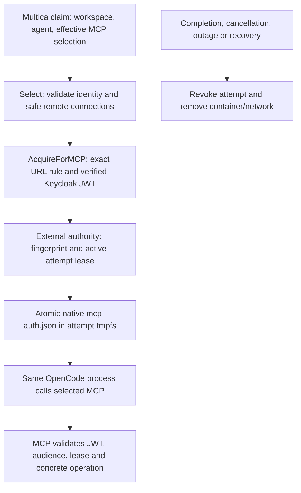

# Experimental OpenCode MCP adapter

The persistent controller's opt-in OpenCode path projects trusted Multica task
context, acquires verified identity and rotates the native MCP OAuth store during
one disposable attempt. OpenCode is pinned to 1.18.34 (source `aec0b9a6`); a version
check precedes execution, including for user-supplied images. Optional inference identity follows ADR 0012. The verified scope and upstream dependencies are listed below.

## Configuration

Start from `deploy/controller.example.json`; set a digest-pinned OpenCode-compatible
image and add `opencode` using `deploy/opencode.example.json`. Mount its identity
configuration, static/external secret files and authority credential **only into the
controller**, for example through a local Compose override. The base Compose manifest
has no corporate identity mounts. Keep all actual configuration outside Git.

`network` names an operator-owned internal bridge template containing exactly the
named `peers`. Each attempt gets a new internal network with only those peers and
its own container. Template peer aliases preserve the selected MCP hostname. Place
Multica, IAM, resolver and credential stores on a separate control network. Only
approved MCP/gateway services may be peers. Enforce host/metadata and destination
policy outside Docker; internal bridges do not establish a production
adversarial egress boundary. Do not attach untrusted workloads/services
to the template. Concurrent attempt containers never share a network.

The default command is `opencode run --format json` with the projected prompt.
An operator-supplied command may use the same `/workspace/prompt.txt` and
`/workspace/opencode.json`; only controller configuration chooses that command.
Images may include their own tools and credential-free provider configuration.
No permanent inference/provider credential is permitted in an image or command;
renewable inference configuration uses the optional `inference_file`; see
[`internal/inference`](../inference/README.md). The fixture supplies a mock provider from
trusted test configuration solely to exercise tool turns without a subscription.

## External authority adapter

`internal/attempt` POSTs authenticated version-1 JSON to one configured endpoint.
It disables redirects/proxy environment, re-reads the controller-only bearer file
and requires HTTP 204. HTTPS is required outside explicit isolated fixtures.
The authority is external; this repository contains only a fixture implementation.

`renew` includes `controller`, the dispatch-fenced `attempt`, `server`,
`workspace_id`, `agent_id`, `task_id`, `mcp_url`, SHA-256 `token_hash`, and epoch-second
`expires_at`. Exactly one of `mcp_url` and `inference_url` identifies the recipient.
It contains no bearer JWT. The authority authenticates the controller,
validates references/recipients, and registers or renews a bounded active grant.
`revoke` ends every fingerprint for an attempt; `recover` ends the controller's
previous grants. Both must be idempotent. Ended attempts cannot be re-enrolled and
a fingerprint cannot move between attempts. Every receiving MCP operation checks
JWT identity/audience and an active unexpired grant, including concrete resources;
`tools/list` must expose only authorized tools. The authority must enforce these
rules independently and fail closed on loss of state. In-flight operation cancellation
is outside this contract. A stopped renewal loop alone does not revoke a JWT.

## Verification and limits

`VERIFY_OPENCODE=1 ./verify.sh` runs real Keycloak and MCP with two native OpenCode
tasks across multiple JWT expiries, separate workspaces/networks and successful
calls under at least three token versions. It covers real issuance
and resolver outages, cancellation, still-unexpired ended-token denial and cleanup.
Add `VERIFY_SERVICE=1` for a real Multica claim through the actual Compose controller.
`VERIFY_CONTAINERS=1` checks projection/network isolation and startup cleanup.

Native JSON events report text/status/thinking and paired tool-use/results to Multica, with ordered sequence numbers and unchanged call IDs. Known projected JWTs (including replaced versions) are redacted; native error bodies are withheld. Limits are 1 MiB per native line, 64 KiB text/result and 10,000 distinct parts per attempt. Exceeding them stops the attempt rather than claiming an intact result. No automatic report replay/outbox or exactly-once terminal callback is promised. MCP roles, resource permissions and model routing remain external. CI remains paused.

`opencode.inference_file` enables the separate inference binding and token path.
See [inference configuration](../inference/README.md) and
[`deploy/inference.example.json`](../../deploy/inference.example.json).

## First adapter contract (issue #24)

Inspected before implementation on 2026-10-05:
Multica `b4ca5b4a23e68b26292a680dca7689a952bb1cd5`;
OpenCode 1.18.34 `aec0b9a6d8898f68f923aaf08b7306d931fd9d76`.

| Capability | Pinned contracts | Selected adapter scope |
| --- | --- | --- |
| Trusted context | Multica daemon Task/AgentData JSON | Instructions, workspace/project context, issue identifier, triggering comment, chat message; bounded prompt, no claim credentials/env/host paths |
| Repository/source inputs | Multica repos: URL, description, ref; project resources use type-specific refs | Credential-free HTTPS repository references in prompt, usable through selected authorized MCP; no clone, host checkout or arbitrary resource materialization |
| Messages | Multica messages: seq, type, call_id, created_at, content/input/output | Native text, reasoning, status, tool-use/result pairs; ordering and opaque call ID preserved |
| Usage | Multica usage upserts cumulative provider/model totals | Native step_finish input/output/reasoning/cache counters; no estimates, pricing or budgets |
| Errors/completion | Native CLI error event may accompany exit 0 | Fail on error or incomplete event stream, report generic failure or numeric HTTP status; complete with native text only after cleanup |
| Sessions | Native sessionID; Multica session/complete/fail fields | Report observed native ID, no work_dir; fresh attempt, terminal session_rollout_missing=true clears resume pointer; resume unsupported |
| Identity | Native OAuth store/provider auth-loader | Existing verified issuance, exact recipient, atomic renewal, external leases/revocation |
| Cancellation/recovery | Multica start/dispatch/status/cancel-ack/recover APIs | Existing fencing, joined exec/renewal, cleanup before terminal callback, restart resource reconciliation |
| Isolation/egress | Maintained Docker internal bridge/read-only/non-root/limits | Disposable per-attempt container/network; fixture isolation evidence, no production hostile host/metadata/destination guarantee |
| Other adapters/images | Native contracts differ | OpenCode 1.18.34 only; image/provider/backend configuration independent |

Unsupported adapter capabilities/dependencies: skills, project resource materialization, broker-managed MCP connections and connected apps,
private Git/artifact delivery without controller credentials in workloads, retained
native sessions and artifact publication, task-scoped Multica tools, agent-scoped
model discovery (#29), production egress enforcement. Do not replace these with a
sandbox Git service, session store, IAM, tools or policy engine. New Kubernetes
ownership/deadlines remain #6; image/tool work remains #4.

Inspection sources: Multica `server/internal/daemon/{types,client}.go`,
`server/internal/handler/daemon.go`, `server/pkg/agent/opencode.go`,
`server/pkg/db/queries/task_usage.sql`; OpenCode
`packages/opencode/src/cli/cmd/run.ts` and native message/token normalization.
Multica daemon client/execenv/repocache are internal, not an external sandbox SDK: reuse supported
HTTP schemas as in ADR 0005; host checkout/cache is not a disposable delivery API. OpenCode CLI owns retry/transport/session
behavior, including HTTP 429 retries. CLI JSON has no model/provider per usage
part; attribution must use the applied model, never an invented fallback.

## Разбор изменений для ревью #24

`internal/opencode/projection.go` собирает ограниченный по размеру prompt из
доверенных полей claim. Repository URL/ref — ссылки, а не команда клонирования.
URL с логином, паролем или query отклоняется; доступ к содержимому остаётся у
выбранного внешнего MCP. Chat/project context передаётся как текст. Секретные
поля claim, host paths и произвольное окружение не копируются.

`internal/docker/projected.go:Stream` читает stdout работающего CLI через pipe.
Docker отвечает за процесс; `internal/opencode/events.go` отвечает за смысл
событий. Ошибка чтения или отчётности завершает exec-клиент, после чего обычный
cleanup удаляет контейнер и сеть. Это не новый цикл рассуждений агента.

Каждое сообщение получает следующий `seq`; tool call и его результат сохраняют
один `call_id`. Повтор native part не создаёт повторные сообщения и usage.
`step_finish` содержит расход одного шага, а API Multica перезаписывает итог:
адаптер суммирует шаги перед отправкой. OpenCode 1.18.34 отдельно считает
reasoning; в Multica он входит в output. Cache read/write передаются отдельно.
Цена и `total` не добавляются к токенам. Model/provider записываются только если
адаптер сам применил модель; для произвольной конфигурации образа CLI не выдаёт
эти идентификаторы, поэтому attribution unsupported.

`execution.Result` переносит текст и native session ID до terminal callback.
`controller.finish` сначала останавливает renewal/exec и удаляет ресурсы, затем
проверяет состояние task и отправляет complete/fail. При cleanup failure нельзя
выдать успешное завершение. Session ID отправляется и во время выполнения;
при complete/fail выставляется `session_rollout_missing`, без `work_dir`; Multica очищает session ID.
Cancel-ack/recovery не поддерживают missing-rollout field: возможный stale pointer никогда не используется адаптером.
Новый attempt всегда создаёт свежую сессию: native database удаляется вместе с
контейнером. Если claim содержит prior session, prompt сообщает об отсутствии
resume; sandbox не пытается восстановить чужое хранилище.

`events_test.go` проверяет ordering, correlation, cumulative usage, повторы,
обрыв потока, malformed/oversized input, ошибку с exit 0 и потерю reporting API.
Реальная fixture проверяет сохранённые messages/session/usage в pinned Multica.
Её детерминированные числа токенов проверяют mapping, а не точность биллинга.
