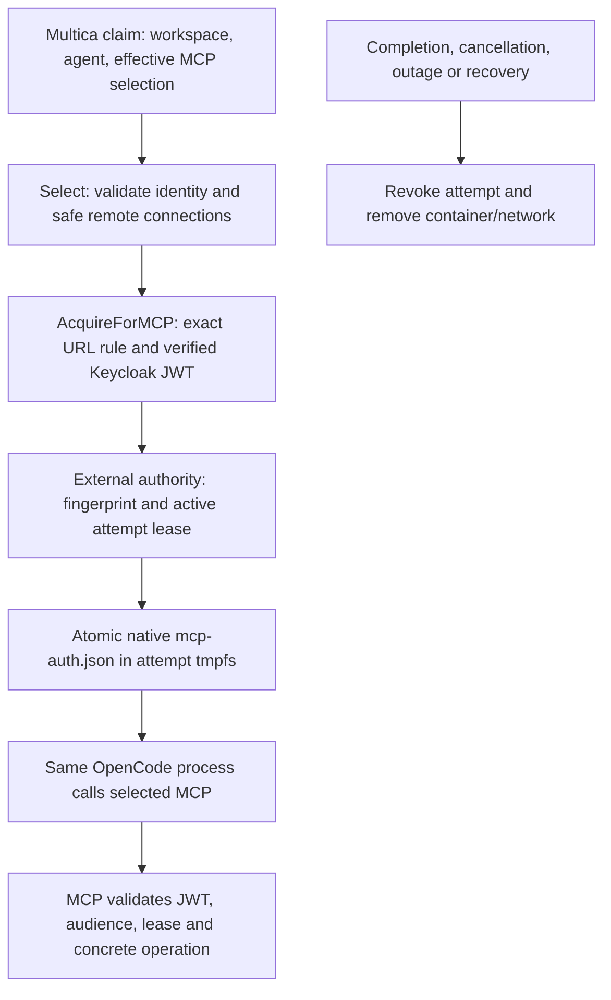

# Experimental OpenCode MCP adapter

The persistent controller's opt-in OpenCode path projects trusted Multica task
context, acquires verified identity and rotates the native MCP OAuth store during
one disposable attempt. OpenCode is pinned to 1.18.34 (source `aec0b9a6`); a version
check precedes execution, including for user-supplied images. Optional inference identity follows ADR 0012; full adapter conformance remains #24.

## Configuration

Start from `deploy/controller.example.json`; set a digest-pinned OpenCode-compatible
image and add `opencode` using `deploy/opencode.example.json`. Mount its identity
configuration, static/external secret files and authority credential **only into the
controller**, for example through a local Compose override. The base Compose manifest
has no corporate identity mounts. Keep all actual configuration outside Git.

`network` names an operator-owned internal bridge template containing exactly the
named `peers`. Each attempt gets a new internal network with only those peers and
its own container. Template peer aliases preserve the selected MCP hostname. Place
Multica, IAM, resolver and credential stores on a separate control network. Only
approved MCP/gateway services may be peers. Enforce host/metadata and destination
policy outside Docker; internal bridges do not establish a production
adversarial egress boundary. Do not attach untrusted workloads/services
to the template. Concurrent attempt containers never share a network.

The default command is `opencode run --format json` with the projected prompt.
An operator-supplied command may use the same `/workspace/prompt.txt` and
`/workspace/opencode.json`; only controller configuration chooses that command.
Images may include their own tools and credential-free provider configuration.
No permanent inference/provider credential is permitted in an image or command;
renewable inference configuration uses the optional `inference_file`; see
[`internal/inference`](../inference/README.md). The fixture supplies a mock provider from
trusted test configuration solely to exercise tool turns without a subscription.

## Review route

1. `internal/service/run.go:Run` wires discovery to `Adapter.Start` and registers
   `opencode` runtimes. Offline probes still register `sandbox-probe`.
2. `multica.Task.ValidAttempt` checks the workspace, agent echo and dispatch fence.
   `Select` accepts the effective `agent.mcp_config.mcpServers` already merged by
   Multica. It rejects local commands, broker connections, supplied headers/OAuth
   and unknown connection fields. No custom environment, service token, session
   path, host mount or claim executable is copied.
3. `running.refresh` checks live Multica status, calls `AcquireForMCP` when less
   than ten seconds remain, and registers the JWT fingerprint before projection.
   It renews the external lease each second, bounded by JWT expiry and 15 seconds.
   Token lifetimes must exceed ten seconds; failed dependencies stop the attempt.
   A rejected claim with confirmed cleanup fails its own task; resource/control-plane
   uncertainty stops the controller.
4. `docker.Projected.Start` creates a fresh non-root, read-only container, 1 GiB
   memory, bounded CPU/PIDs and tmpfs. `Write` sends bytes on Docker exec stdin,
   writes a mode-0600 temporary file and atomically renames it. No bearer appears
   in Docker argv, environment, host mounts or logs.
5. `project` writes only `serverUrl`, `tokens.accessToken` and epoch-seconds
   `tokens.expiresAt` per selected name. No client secret, refresh token, OAuth
   client metadata or synthetic authorization header enters the store.
6. `Remove` joins renewal, revokes the attempt, and removes its container and
   network even if authority revocation fails. Cleanup uncertainty stops the
   controller; downstream leases bound crash/outage admission. Startup removes
   owned resources and invokes authority recovery before accepting claims.

OpenCode uses its native MCP transport. Native OAuth reads the replacement file
in the running process. The global config directory is read-only, avoiding
OpenCode's startup package install.

## External authority adapter

`internal/attempt` POSTs authenticated version-1 JSON to one configured endpoint.
It disables redirects/proxy environment, re-reads the controller-only bearer file
and requires HTTP 204. HTTPS is required outside explicit isolated fixtures.
The authority is external; this repository contains only a fixture implementation.

`renew` includes `controller`, the dispatch-fenced `attempt`, `server`,
`workspace_id`, `agent_id`, `task_id`, `mcp_url`, SHA-256 `token_hash`, and epoch-second
`expires_at`. Exactly one of `mcp_url` and `inference_url` identifies the recipient.
It contains no bearer JWT. The authority authenticates the controller,
validates references/recipients, and registers or renews a bounded active grant.
`revoke` ends every fingerprint for an attempt; `recover` ends the controller's
previous grants. Both must be idempotent. Ended attempts cannot be re-enrolled and
a fingerprint cannot move between attempts. Every receiving MCP operation checks
JWT identity/audience and an active unexpired grant, including concrete resources;
`tools/list` must expose only authorized tools. The authority must enforce these
rules independently and fail closed on loss of state. In-flight operation cancellation
is outside this contract. A stopped renewal loop alone does not revoke a JWT.

## Verification and limits

`VERIFY_OPENCODE=1 ./verify.sh` runs real Keycloak and MCP with two native OpenCode
tasks across multiple JWT expiries, separate workspaces/networks and successful
calls under at least three token versions. It covers real issuance
and resolver outages, cancellation, still-unexpired ended-token denial and cleanup.
Add `VERIFY_SERVICE=1` for a real Multica claim through the actual Compose controller.
`VERIFY_CONTAINERS=1` checks projection/network isolation and startup cleanup.

Supported context is instructions, workspace context, issue ID and triggering
comment. Repositories, skills, broker-managed connections, prior sessions and
full events/usage/artifact reporting are not supported. A zero-exit CLI process
without an error event yields an explicit experimental completion description;
it does not certify requested work or produce a retained result artifact. MCP roles,
resource permissions and model routing remain external. CI remains paused.

`opencode.inference_file` enables the separate inference binding and token path.
See [inference configuration](../inference/README.md) and
[`deploy/inference.example.json`](../../deploy/inference.example.json).
